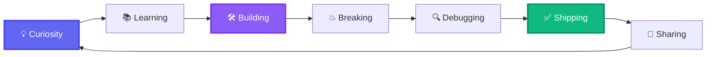

<div align="center">

# 🌟 Welcome to My Digital Playground 🌟


### 🎓 AI & Data Science Engineer in the Making | 🚀 Building Tomorrow's Intelligence Today

</div>

---

## 🎭 Who Am I?

```python
#!/usr/bin/env python3
# rizwana.py - My Digital DNA

class RizwanaNesrin:
    def __init__(self):
        self.username = "Rizwana Nesrin"
        self.current_status = "B.Tech AI & Data Science Student"
        self.dream_job = "AI/ML Engineer"
        self.superpower = "Turning abstract ideas into intelligent systems"
        self.fuel = ["Coffee ☕", "Curiosity 🔍", "Code 💻"]
        
    def my_mantra(self):
        return """
        🔥 Build it. Break it. Learn from it. Ship it.
        💡 Every dataset tells a story. I'm here to listen.
        🚀 Raw ideas → Working systems → Real impact
        """
    
    def what_excites_me(self):
        return {
            "🧠 Machine Learning": "Making machines think",
            "✨ Generative AI": "Creating intelligence that creates",
            "🗄️ Data Warehousing": "Building the backbone of insights",
            "📊 Data Visualization": "Painting pictures with data",
            "⚡ Automation": "Because life's too short for repetitive tasks"
        }
    
    def current_mission(self):
        return "Experimenting, building, and sharing AI solutions that matter"

# Initialize
me = RizwanaNesrin()
print(me.my_mantra())
```

<div align="center">

### 🎯 *"I don't just study AI — I build it, experiment with it, and make it come alive."*

</div>

---

## 🛠️ My Arsenal

<div align="center">

### Languages & Core Tech


### AI/ML & Data Science


### Generative AI & LLMs


### Data & Databases


### Visualization & BI


</div>

---

## 🎨 What I'm Building

<table>
<tr>
<td width="50%">

### 🏗️ SQL Data Warehouse
```sql
-- Building the foundation of intelligence
CREATE DATABASE insights_engine;
-- Structuring chaos into clarity
-- ETL pipelines that just work
-- Data that tells compelling stories
```

**Status:** 🚧 In Progress  
**Impact:** Making data accessible & actionable

</td>
<td width="50%">

### 🤖 ML Models
```python
# Training intelligence
model = MyBrain()
model.learn(data, experience)
model.predict(future)
# From classification to clustering
# From theory to deployment
```

**Status:** 🧪 Experimenting  
**Impact:** Solving real-world problems

</td>
</tr>
<tr>
<td width="50%">

### ✨ Generative AI Projects
```python
# Creating intelligence that creates
gen_ai = CreativeAI()
gen_ai.imagine()
gen_ai.generate()
gen_ai.amaze()
# Building the next wave of AI
```

**Status:** 🎨 Creating  
**Impact:** Pushing boundaries of what's possible

</td>
<td width="50%">

### 📊 Data Visualizations
```python
# Making data beautiful
viz = DataStory(raw_data)
viz.clean().transform()
viz.plot().animate()
# Numbers → Insights → Actions
```

**Status:** 📈 Iterating  
**Impact:** Turning data into decisions

</td>
</tr>
</table>

---

## 🔥 My Learning Journey



---

## 📊 GitHub Analytics

<div align="center">


</div>

<div align="center">


</div>

<div align="center">


</div>

---

## 🏆 Achievements & Highlights

<div align="center">


</div>

---

## 💭 My Philosophy

<div align="center">

### 🎯 The Build-Learn-Share Loop

</div>

```
┌─────────────────────────────────────────────────────────────┐
│                                                             │
│  "The best way to understand AI is to build it.            │
│   The best way to master ML is to experiment with it.      │
│   The best way to grow is to share what you learn."        │
│                                                             │
│                    - My Engineering Mantra                  │
│                                                             │
└─────────────────────────────────────────────────────────────┘
```

<table>
<tr>
<td align="center" width="33%">

### 🛠️ BUILD
*Ideas → Prototypes*  
*Concepts → Code*  
*Dreams → Deployments*

</td>
<td align="center" width="33%">

### 🧪 EXPERIMENT
*Test hypotheses*  
*Break things*  
*Learn what works*

</td>
<td align="center" width="33%">

### 📢 SHARE
*Document learnings*  
*Open source*  
*Help others grow*

</td>
</tr>
</table>

---

## 🌈 Beyond the Code

```python
interests = {
    "📖": "Reading AI research papers over breakfast",
    "🎮": "Breaking down game AI mechanics",
    "🎨": "Exploring the intersection of art & algorithms",
    "🌱": "Contributing to open source",
    "💬": "Discussing the ethics of AI",
    "🎯": "Setting ambitious goals, then crushing them"
}
```

---

## 📫 Let's Connect & Collaborate!

<div align="center">

### 🤝 I'm always excited to discuss AI, collaborate on projects, or just chat about tech!

<br>

[](YOUR_LINKEDIN)
[](https://github.com/YOUR_USERNAME)
[](mailto:YOUR_EMAIL)
[](YOUR_TWITTER)
[](YOUR_PORTFOLIO)

<br>

### 💌 Open for:
`Collaborations` • `Interesting Projects` • `Learning Opportunities` • `Tech Discussions` • `Mentorship`

</div>

---

## 🎁 Fun Facts

<div align="center">

| 🎯 Current Goal | 🎵 Coding Music | ☕ Coffee Count | 🌙 Night Owl? | 🚀 Dream Project |
|:---------------:|:---------------:|:---------------:|:-------------:|:----------------:|
| Master GenAI | Lo-fi Beats | ∞ cups/day | Absolutely! | AGI Research |

</div>

---

<div align="center">

### 📊 Profile Stats


<br>

### 🌟 "Star my repos if something sparks your interest!"

<br>


<br>


### Made with 💜 and lots of ☕

*Last Updated: October 2025*

</div>

